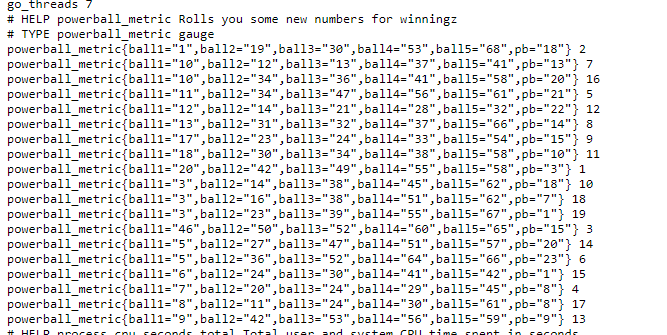

# PowerBall Exporter

An exporter for randomly generated seeds for powerball numbers

```
                                                       /$$                 /$$ /$$
                                                      | $$                | $$| $$
  /$$$$$$   /$$$$$$  /$$  /$$  /$$  /$$$$$$   /$$$$$$ | $$$$$$$   /$$$$$$ | $$| $$
|/$$__  $$ /$$__  $$| $$ | $$ | $$ /$$__  $$ /$$__  $$| $$__  $$ |____  $$| $$| $$
| $$  \ $$| $$  \ $$| $$ | $$ | $$| $$$$$$$$| $$  \__/| $$  \ $$  /$$$$$$$| $$| $$
| $$  | $$| $$  | $$| $$ | $$ | $$| $$_____/| $$      | $$  | $$ /$$__  $$| $$| $$
| $$$$$$$/|  $$$$$$/|  $$$$$/$$$$/|  $$$$$$$| $$      | $$$$$$$/|  $$$$$$$| $$| $$
| $$____/  \______/  \_____/\___/  \_______/|__/      |_______/  \_______/|__/|__/
| $$                                                                              
| $$                                                                              
|__/                                                                             
```

## Run
Run docker-compose to run this exporter

### Example Image
